# OCX Protocol v1.0.0-rc.1

**Mathematical proof for computational integrity**


[](https://github.com/ocx-protocol/ocx)
[](./docs/spec-v1.md)
[](./conformance)
[](./scripts/determinism.sh)

## 🏗️ Architecture Overview

```mermaid
flowchart TB
%% ======== CLASSES / STYLES ========
classDef actor fill:#fdf6e3,stroke:#333,stroke-width:1px,color:#111;
classDef adapter fill:#e8f0ff,stroke:#4e79a7,stroke-width:1px,color:#0b2545;
classDef api fill:#e8f5e9,stroke:#2e7d32,color:#0a2f14;
classDef core fill:#fff3e0,stroke:#ef6c00,color:#3b2200;
classDef verify fill:#e3f2fd,stroke:#1565c0,color:#0a1e3b;
classDef store fill:#ede7f6,stroke:#5e35b1,color:#28124d;
classDef policy fill:#fffde7,stroke:#f9a825,color:#443600;
classDef analytics fill:#e0f7f7,stroke:#00796b,color:#003d39;
classDef gov fill:#fce4ec,stroke:#ad1457,color:#520a26;
classDef security fill:#f3e5f5,stroke:#6a1b9a,color:#2f0a4d;

%% ======== LAYER: ACTORS ========
subgraph L0["🎭 Actors & Stakeholders"]
direction TB
A1[Developers / Integrators]:::actor
A2[Operators / FinOps / Compliance]:::actor
A3[Auditors / Insurers / Regulators]:::actor
A4[End Users / Customers]:::actor
end

%% ======== LAYER: ADAPTERS ========
subgraph L1["🔌 Adapters (Drop-ins)"]
direction LR
AD1["GitHub Action<br/>ocx-verify-action"]:::adapter
AD2["Kubernetes Webhook<br/>label: ocx=on"]:::adapter
AD3["Airflow Operator<br/>@ocx.task"]:::adapter
AD4["FFmpeg Filter<br/>-vf ocx=emit=1"]:::adapter
AD5["PyTorch Wrapper<br/>ocx.exec(...)"]:::adapter
AD6["CLI Wrapper<br/>ocx run -- cmd"]:::adapter
end

%% ======== LAYER: API/SDK ========
subgraph L2["⚡ Ingress (CLI / SDK / API)"]
direction LR
CLI[minimal-cli]:::api
SDK["SDKs<br/>(Go/Python/Rust)"]:::api
REST["/REST API<br/>/api/v1/execute<br/>/api/v1/verify<br/>/api/v1/receipts/"]:::api
end

%% ======== LAYER: OCX CORE ========
subgraph L3["🔥 OCX Core (v1-min)"]
direction TB
C0["Spec v1-min (FROZEN)<br/>profile_id=1"]:::core
C1["Deterministic VM<br/>(no clock/syscalls/threads/FP)"]:::core
C2["Cycle Meter<br/>(alpha,beta,gamma)"]:::core
C3["Transcript Builder<br/>Hash chain → Merkle root"]:::core
C4["CBOR Serializer<br/>(canonical, strict)"]:::core
C5[Ed25519 Signer]:::core
C6["Receipt Emitter<br/>{artifact_hash,input_hash,output_hash,<br/>cycles,transcript_root,sig}"]:::core
end

%% ======== LAYER: CRI / CONFORMANCE ========
subgraph L4["✅ Truth & Conformance"]
direction LR
T1["CRI-lite (Executable Spec)<br/>slow reference interpreter"]:::verify
T2["Conformance Suite<br/>Golden receipts & vectors"]:::verify
T3["Cross-Arch Determinism Job<br/>(x86 ↔ ARM buildx/QEMU)"]:::verify
end

%% ======== LAYER: STORAGE / VERIFY ========
subgraph L5["🔍 Verify & Storage"]
direction LR
V1["Offline Verifier (lib/CLI)<br/>subtle.ConstantTimeCompare"]:::verify
V2["Hosted Verify API<br/>stateless, $5/M checks"]:::verify
S1["Receipts Store / Index<br/>immutable table + search<br/>($3/M receipts-mo)"]:::store
S2["Exporters<br/>CSV / Parquet"]:::store
end

%% ======== LAYER: POLICY / EXT (Optional) ========
subgraph L6["📋 Policy Layer (Optional, Out-of-Band)"]
direction LR
P1["OCX-EXT Envelope<br/>keeps base receipt pure"]:::policy
P2["Auditor Quorum<br/>N-of-M signatures over receipt_hash"]:::policy
P3["Billing / Chargeback<br/>cycles→$ mapping"]:::policy
P4["Compliance Mapping<br/>controls→evidence"]:::policy
end

%% ======== LAYER: ANALYTICS / BENCH ========
subgraph L7["📊 Analytics & Bench (No PII)"]
direction LR
AN1["Benchmarks<br/>exec/verify p50/p99"]:::analytics
AN2["Determinism Lab<br/>matrix across arches/vendors"]:::analytics
AN3["Atlas (Aggregate Patterns)<br/>privacy-preserving"]:::analytics
end

%% ======== LAYER: GOVERNANCE / VERSIONING / SECURITY ========
subgraph L8["🛡️ Governance / Profiles / Security"]
direction LR
G1["Profiles<br/>v1-min, v1-fp, v1-gpu<br/>(new capability = new profile)"]:::gov
G2["DISPUTES.md<br/>Drift Playbook → new golden"]:::gov
G3["FAIRNESS.md & PRICING.md<br/>(convenience + assurance only)"]:::gov
SEC1["Strict CBOR / size caps<br/>reject duplicate keys"]:::security
SEC2[Constant-time compares]:::security
SEC3[Rate/timeout bounds]:::security
end

%% ======== FLOWS ========
%% Adapters feed ingress
A1 --> AD1
A1 --> AD2
A1 --> AD3
A4 --> AD4
A1 --> AD5
A1 --> AD6

AD1 --> CLI
AD2 --> REST
AD3 --> SDK
AD4 --> CLI
AD5 --> SDK
AD6 --> CLI

%% Execute path
CLI -->|"OCX_EXEC<br/>artifact,input,max_cycles"| C1
SDK -->|OCX_EXEC| C1
REST -->|OCX_EXEC| C1

C1 --> C2 --> C3 --> C4 --> C5 --> C6
C6 -.->|"receipt (CBOR+sig)"| V1
C6 -.->|receipt| S1
C6 -.->|receipt| V2
C6 -.->|receipt| P3

%% Verify paths
V1 -->|"verify(receipt)"| A2
V2 -->|"verify API"| A2
A3 -->|"offline verify"| V1

%% Conformance / truth loop
T2 -->|"golden vectors"| C1
C6 -.->|"computed receipts"| T2
T1 -->|"arbitrate drift"| T2
T3 -->|"amd64 vs arm64 identical<br/>receipt_hash"| T2

%% Policy/EXT is optional
S1 -.->|receipt_hash| P2
P2 ..->|"quorum attestations"| A3
P4 ..->|"maps receipts→controls"| A2

%% Analytics/bench (aggregate)
S1 -.-> AN1
V2 -.-> AN1
T3 -.-> AN2
AN1 -.-> A2
AN2 -.-> A2

%% Governance / security influence
G1 --> C0
G2 --> T2
G3 --> P3
SEC1 --> C4
SEC2 --> V1
SEC3 --> REST

%% ======== NUMBERED CALLOUTS ========
C6 -.- N1["①<br/>Proof, not promises:<br/>receipts encode what ran"]
V1 -.- N2["②<br/>Offline verify:<br/>no network needed"]
T3 -.- N3["③<br/>Cross-arch determinism:<br/>identical hashes"]
G1 -.- N4["④<br/>Frozen spec + profiles:<br/>v1-min never changes"]
P1 -.- N5["⑤<br/>Policy out-of-band:<br/>base receipt stays pure"]
P3 -.- N6["⑥<br/>Fair economics:<br/>convenience + assurance only"]

%% ======== LEGEND ========
subgraph Legend["📖 Legend"]
direction TB
Lsolid["→ Solid: control/API call"]:::actor
Ldash["-.-> Dashed: data artifact (receipt/golden/hash)"]:::actor  
Ldot["..-> Dotted: optional/hosted/policy-layer"]:::actor
end
```



**[📖 Full Architecture Documentation](./docs/architecture-diagram.md) | [🖼️ A3 Poster](./posters/OCX_Architecture_A3_Poster.md) | [📐 SVG Diagram](./docs/architecture-diagram.svg)**

## Quick Start

```bash
# Run simple demo (recommended first)
make simple-demo

# Run killer applications demo
make demo

# Quick GPU verification
./scripts/test_rtx5060.sh quick

# Live GPU monitoring
./scripts/test_rtx5060.sh monitor

# Full end-to-end test (offer → order → provision → monitor → settle)
./scripts/test_rtx5060.sh full
```

## Killer Applications

OCX Protocol includes ready-to-run programs that demonstrate its power:

1. **AlphaFold Protein Folding** - Simulates protein folding energy calculations
2. **LLVM Compiler Testing** - Tests compiler optimization passes
3. **Bitcoin Difficulty Adjustment** - Implements mining difficulty algorithms
4. **Doom Physics Simulation** - Game engine physics with collision detection
5. **WebGL Benchmark** - GPU shader compilation and performance testing

Each program runs deterministically with cryptographic receipts, cycle-accurate metering, and verifiable results.

## Architecture

```
.
├── cmd/ocx-gpu-test/           # Single, clean binary
│   └── main.go
├── internal/
│   ├── gpu/                    # NVIDIA GPU adapter & metrics
│   │   ├── info.go
│   │   ├── monitor.go
│   │   └── runmodes.go
│   └── ocxstub/                # Drop-in OCX client stub
│       └── client.go
├── scripts/
│   └── test_rtx5060.sh
└── bin/
    └── ocx-gpu-test            # Built binary
```

## Features

- **Real Hardware Integration**: Works with actual NVIDIA GPUs via `nvidia-smi`
- **Complete Business Flow**: Order → Matching → Provisioning → Usage → Settlement
- **Live Monitoring**: Real-time GPU metrics (utilization, temperature, memory, power)
- **Production Ready**: Clean architecture, proper error handling, JSON logging
- **Drop-in Replacement**: Easy to swap `ocxstub` with real OCX client

## GPU Requirements

- NVIDIA GPU with `nvidia-smi` support
- Driver version 570+ recommended
- CUDA toolkit optional (for workload testing)

## Example Output

```bash
$ ./scripts/test_rtx5060.sh quick
GPU=NVIDIA Graphics Device, Mem=8151MB, Driver=570.153.02, Temp=56C, Util=84%

$ ./scripts/test_rtx5060.sh full
GPU=NVIDIA Graphics Device, Mem=8151MB, Driver=570.153.02, Temp=61C, Util=87%
offer=offer_1757963962616250243 $/h=2.50
order=order_1757963962616254021
matched order=order_1757963962616254021 provider=local-nvidia-provider
lease=lease_1757963964625396154 addr=192.168.150.102:22 ssh_user=kurokernel
util=96% temp=61C mem=851/8151MB power=0W
util=99% temp=60C mem=853/8151MB power=0W
full test complete
```

## Development

```bash
# Build the binary
go build -o ./bin/ocx-gpu-test ./cmd/ocx-gpu-test

# Run with custom options
./bin/ocx-gpu-test -test=monitor -duration=60s -server=http://localhost:8080
```

## Integration

To integrate with a real OCX server, replace `internal/ocxstub` with `internal/ocxclient` implementing:

```go
CreateOffer(price float64) (*Offer, error)
PlaceOrder(offerID string, gpus, hours int, budget float64) (*Order, error)
WaitMatch(orderID string, timeout time.Duration) error
Provision(orderID string) (*Lease, error)
Settle(orderID string, amount float64) error
Release(leaseID string) error
```

No other code changes required.
