# OCX Master Architecture Diagram

## Overview
This diagram shows the complete OCX Protocol architecture with all layers, components, and data flows. The diagram is designed to be updated only when profiles or adapters change, while the core v1-min specification remains frozen.

## Interactive Diagram

```mermaid
flowchart TB
%% ======== CLASSES / STYLES ========
classDef actor fill:#fdf6e3,stroke:#333,stroke-width:1px,color:#111;
classDef adapter fill:#e8f0ff,stroke:#4e79a7,stroke-width:1px,color:#0b2545;
classDef api fill:#e8f5e9,stroke:#2e7d32,color:#0a2f14;
classDef core fill:#fff3e0,stroke:#ef6c00,color:#3b2200;
classDef verify fill:#e3f2fd,stroke:#1565c0,color:#0a1e3b;
classDef store fill:#ede7f6,stroke:#5e35b1,color:#28124d;
classDef policy fill:#fffde7,stroke:#f9a825,color:#443600;
classDef analytics fill:#e0f7f7,stroke:#00796b,color:#003d39;
classDef gov fill:#fce4ec,stroke:#ad1457,color:#520a26;
classDef security fill:#f3e5f5,stroke:#6a1b9a,color:#2f0a4d;

%% ======== LAYER: ACTORS ========
subgraph L0["🎭 Actors & Stakeholders"]
direction TB
A1[Developers / Integrators]:::actor
A2[Operators / FinOps / Compliance]:::actor
A3[Auditors / Insurers / Regulators]:::actor
A4[End Users / Customers]:::actor
end

%% ======== LAYER: ADAPTERS ========
subgraph L1["🔌 Adapters (Drop-ins)"]
direction LR
AD1["GitHub Action<br/>ocx-verify-action"]:::adapter
AD2["Kubernetes Webhook<br/>label: ocx=on"]:::adapter
AD3["Airflow Operator<br/>@ocx.task"]:::adapter
AD4["FFmpeg Filter<br/>-vf ocx=emit=1"]:::adapter
AD5["PyTorch Wrapper<br/>ocx.exec(...)"]:::adapter
AD6["CLI Wrapper<br/>ocx run -- cmd"]:::adapter
end

%% ======== LAYER: API/SDK ========
subgraph L2["⚡ Ingress (CLI / SDK / API)"]
direction LR
CLI[minimal-cli]:::api
SDK["SDKs<br/>(Go/Python/Rust)"]:::api
REST["/REST API<br/>/api/v1/execute<br/>/api/v1/verify<br/>/api/v1/receipts/"]:::api
end

%% ======== LAYER: OCX CORE ========
subgraph L3["🔥 OCX Core (v1-min)"]
direction TB
C0["Spec v1-min (FROZEN)<br/>profile_id=1"]:::core
C1["Deterministic VM<br/>(no clock/syscalls/threads/FP)"]:::core
C2["Cycle Meter<br/>(alpha,beta,gamma)"]:::core
C3["Transcript Builder<br/>Hash chain → Merkle root"]:::core
C4["CBOR Serializer<br/>(canonical, strict)"]:::core
C5[Ed25519 Signer]:::core
C6["Receipt Emitter<br/>{artifact_hash,input_hash,output_hash,<br/>cycles,transcript_root,sig}"]:::core
end

%% ======== LAYER: CRI / CONFORMANCE ========
subgraph L4["✅ Truth & Conformance"]
direction LR
T1["CRI-lite (Executable Spec)<br/>slow reference interpreter"]:::verify
T2["Conformance Suite<br/>Golden receipts & vectors"]:::verify
T3["Cross-Arch Determinism Job<br/>(x86 ↔ ARM buildx/QEMU)"]:::verify
end

%% ======== LAYER: STORAGE / VERIFY ========
subgraph L5["🔍 Verify & Storage"]
direction LR
V1["Offline Verifier (lib/CLI)<br/>subtle.ConstantTimeCompare"]:::verify
V2["Hosted Verify API<br/>stateless, $5/M checks"]:::verify
S1["Receipts Store / Index<br/>immutable table + search<br/>($3/M receipts-mo)"]:::store
S2["Exporters<br/>CSV / Parquet"]:::store
end

%% ======== LAYER: POLICY / EXT (Optional) ========
subgraph L6["📋 Policy Layer (Optional, Out-of-Band)"]
direction LR
P1["OCX-EXT Envelope<br/>keeps base receipt pure"]:::policy
P2["Auditor Quorum<br/>N-of-M signatures over receipt_hash"]:::policy
P3["Billing / Chargeback<br/>cycles→$ mapping"]:::policy
P4["Compliance Mapping<br/>controls→evidence"]:::policy
end

%% ======== LAYER: ANALYTICS / BENCH ========
subgraph L7["📊 Analytics & Bench (No PII)"]
direction LR
AN1["Benchmarks<br/>exec/verify p50/p99"]:::analytics
AN2["Determinism Lab<br/>matrix across arches/vendors"]:::analytics
AN3["Atlas (Aggregate Patterns)<br/>privacy-preserving"]:::analytics
end

%% ======== LAYER: GOVERNANCE / VERSIONING / SECURITY ========
subgraph L8["🛡️ Governance / Profiles / Security"]
direction LR
G1["Profiles<br/>v1-min, v1-fp, v1-gpu<br/>(new capability = new profile)"]:::gov
G2["DISPUTES.md<br/>Drift Playbook → new golden"]:::gov
G3["FAIRNESS.md & PRICING.md<br/>(convenience + assurance only)"]:::gov
SEC1["Strict CBOR / size caps<br/>reject duplicate keys"]:::security
SEC2[Constant-time compares]:::security
SEC3[Rate/timeout bounds]:::security
end

%% ======== FLOWS ========
%% Adapters feed ingress
A1 --> AD1
A1 --> AD2
A1 --> AD3
A4 --> AD4
A1 --> AD5
A1 --> AD6

AD1 --> CLI
AD2 --> REST
AD3 --> SDK
AD4 --> CLI
AD5 --> SDK
AD6 --> CLI

%% Execute path
CLI -->|"OCX_EXEC<br/>artifact,input,max_cycles"| C1
SDK -->|OCX_EXEC| C1
REST -->|OCX_EXEC| C1

C1 --> C2 --> C3 --> C4 --> C5 --> C6
C6 -.->|"receipt (CBOR+sig)"| V1
C6 -.->|receipt| S1
C6 -.->|receipt| V2
C6 -.->|receipt| P3

%% Verify paths
V1 -->|"verify(receipt)"| A2
V2 -->|"verify API"| A2
A3 -->|"offline verify"| V1

%% Conformance / truth loop
T2 -->|"golden vectors"| C1
C6 -.->|"computed receipts"| T2
T1 -->|"arbitrate drift"| T2
T3 -->|"amd64 vs arm64 identical<br/>receipt_hash"| T2

%% Policy/EXT is optional
S1 -.->|receipt_hash| P2
P2 ..->|"quorum attestations"| A3
P4 ..->|"maps receipts→controls"| A2

%% Analytics/bench (aggregate)
S1 -.-> AN1
V2 -.-> AN1
T3 -.-> AN2
AN1 -.-> A2
AN2 -.-> A2

%% Governance / security influence
G1 --> C0
G2 --> T2
G3 --> P3
SEC1 --> C4
SEC2 --> V1
SEC3 --> REST

%% ======== NUMBERED CALLOUTS ========
C6 -.- N1["①<br/>Proof, not promises:<br/>receipts encode what ran"]
V1 -.- N2["②<br/>Offline verify:<br/>no network needed"]
T3 -.- N3["③<br/>Cross-arch determinism:<br/>identical hashes"]
G1 -.- N4["④<br/>Frozen spec + profiles:<br/>v1-min never changes"]
P1 -.- N5["⑤<br/>Policy out-of-band:<br/>base receipt stays pure"]
P3 -.- N6["⑥<br/>Fair economics:<br/>convenience + assurance only"]

%% ======== LEGEND ========
subgraph Legend["📖 Legend"]
direction TB
Lsolid["→ Solid: control/API call"]:::actor
Ldash["-.-> Dashed: data artifact (receipt/golden/hash)"]:::actor  
Ldot["..-> Dotted: optional/hosted/policy-layer"]:::actor
end
```

## Key Components

### 🎭 Actors & Stakeholders
- **Developers/Integrators**: Build applications using OCX
- **Operators/FinOps/Compliance**: Manage and monitor OCX deployments
- **Auditors/Insurers/Regulators**: Verify and validate computations
- **End Users/Customers**: Consume verified computation results

### 🔌 Adapters (Drop-ins)
- **GitHub Action** (`ocx-verify-action`): CI/CD integration
- **Kubernetes Webhook** (`label: ocx=on`): Container orchestration
- **Airflow Operator** (`@ocx.task`): Workflow automation
- **FFmpeg Filter** (`-vf ocx=emit=1`): Media processing
- **PyTorch Wrapper** (`ocx.exec(...)`): ML/AI integration
- **CLI Wrapper** (`ocx run -- cmd`): Command-line integration

### ⚡ Ingress (CLI / SDK / API)
- **minimal-cli**: Command-line interface
- **SDKs**: Go/Python/Rust client libraries
- **REST API**: HTTP endpoints for execution and verification

### 🔥 OCX Core (v1-min)
- **Spec v1-min (FROZEN)**: Immutable specification
- **Deterministic VM**: No clock/syscalls/threads/FP
- **Cycle Meter**: Precise resource measurement
- **Transcript Builder**: Hash chain to Merkle root
- **CBOR Serializer**: Canonical, strict encoding
- **Ed25519 Signer**: Cryptographic signatures
- **Receipt Emitter**: Proof of computation

### ✅ Truth & Conformance
- **CRI-lite**: Executable specification reference
- **Conformance Suite**: Golden receipts and test vectors
- **Cross-Arch Determinism**: Identical results across architectures

### 🔍 Verify & Storage
- **Offline Verifier**: Constant-time verification
- **Hosted Verify API**: Stateless verification service
- **Receipts Store**: Immutable storage with search
- **Exporters**: Data export utilities

### 📋 Policy Layer (Optional)
- **OCX-EXT Envelope**: Optional metadata
- **Auditor Quorum**: Multi-signature validation
- **Billing/Chargeback**: Cost management
- **Compliance Mapping**: Regulatory compliance

### 📊 Analytics & Bench
- **Benchmarks**: Performance metrics
- **Determinism Lab**: Cross-platform testing
- **Atlas**: Privacy-preserving analytics

### 🛡️ Governance / Security
- **Profiles**: Version management (v1-min, v1-fp, v1-gpu)
- **Disputes**: Drift resolution procedures
- **Fairness**: Economic principles
- **Security**: Strict validation and rate limiting

## Key Principles

### ① Proof, not promises
OCX receipts contain mathematical proof of execution - artifact hash, input hash, output hash, cycle count, and cryptographic signature. No identity data, just verifiable facts.

### ② Offline verify
Anyone can validate receipts without network access using only the receipt blob and public key. No dependency on external services or registries.

### ③ Cross-arch determinism
The same computation produces identical receipt hashes on x86 and ARM architectures, proving true deterministic execution.

### ④ Frozen spec + profiles
The v1-min specification never changes. New capabilities get new profile IDs (v1-fp, v1-gpu), ensuring backward compatibility forever.

### ⑤ Policy out-of-band
OCX-EXT envelope carries optional metadata like auditor signatures or KYC data, keeping the base receipt identity-free and pure.

### ⑥ Fair economics
Revenue comes from convenience (hosted APIs) and assurance (audit services), never from lock-in or extraction. Users can always self-host and export data.

## Repository Links

- **CRI**: [/conformance](/conformance) - Conformance testing and reference implementation
- **minimal-cli**: [/cmd/minimal-cli](/cmd/minimal-cli) - Command-line interface
- **REST API**: [/gateway.go](/gateway.go) - HTTP API endpoints
- **OCX Core**: [/pkg/ocx](/pkg/ocx) - Core protocol implementation
- **Receipt System**: [/pkg/receipt](/pkg/receipt) - Receipt generation and verification
- **Storage**: [/store](/store) - Database layer and persistence
- **Conformance**: [/conformance](/conformance) - Test vectors and validation
- **Scripts**: [/scripts](/scripts) - Build and deployment scripts
- **Documentation**: [/docs](/docs) - Technical documentation

## Update Policy

This diagram is updated only when:
- New profiles are added (v1-fp, v1-gpu, etc.)
- New adapters are created
- New API endpoints are added
- New storage or verification components are introduced

The core v1-min specification remains frozen and never changes.
