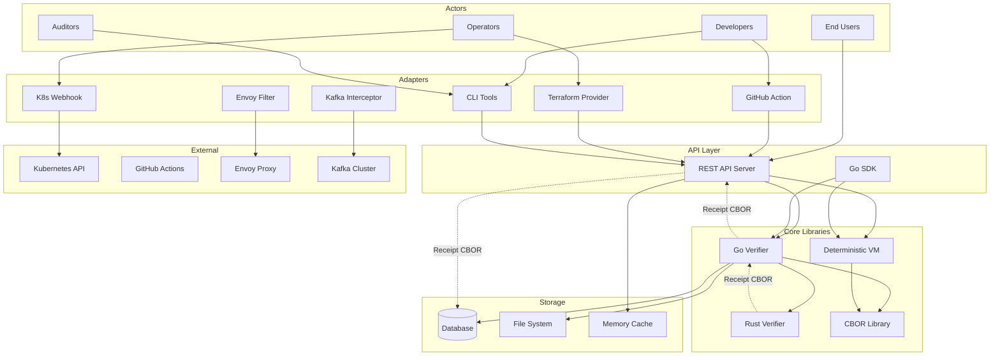
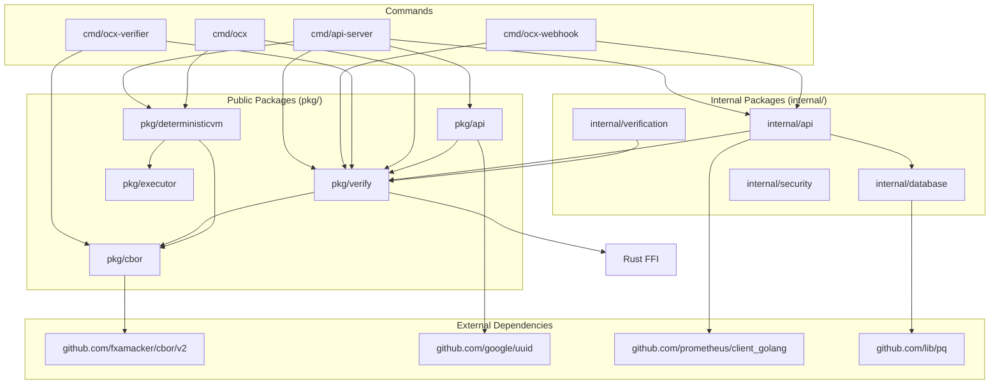
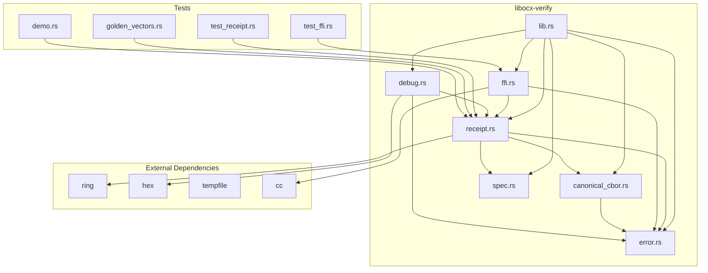
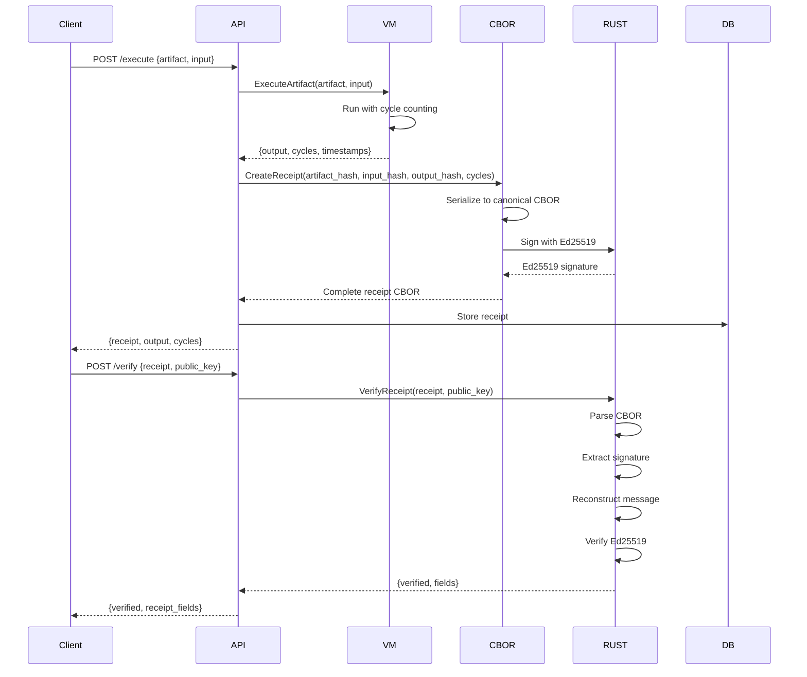
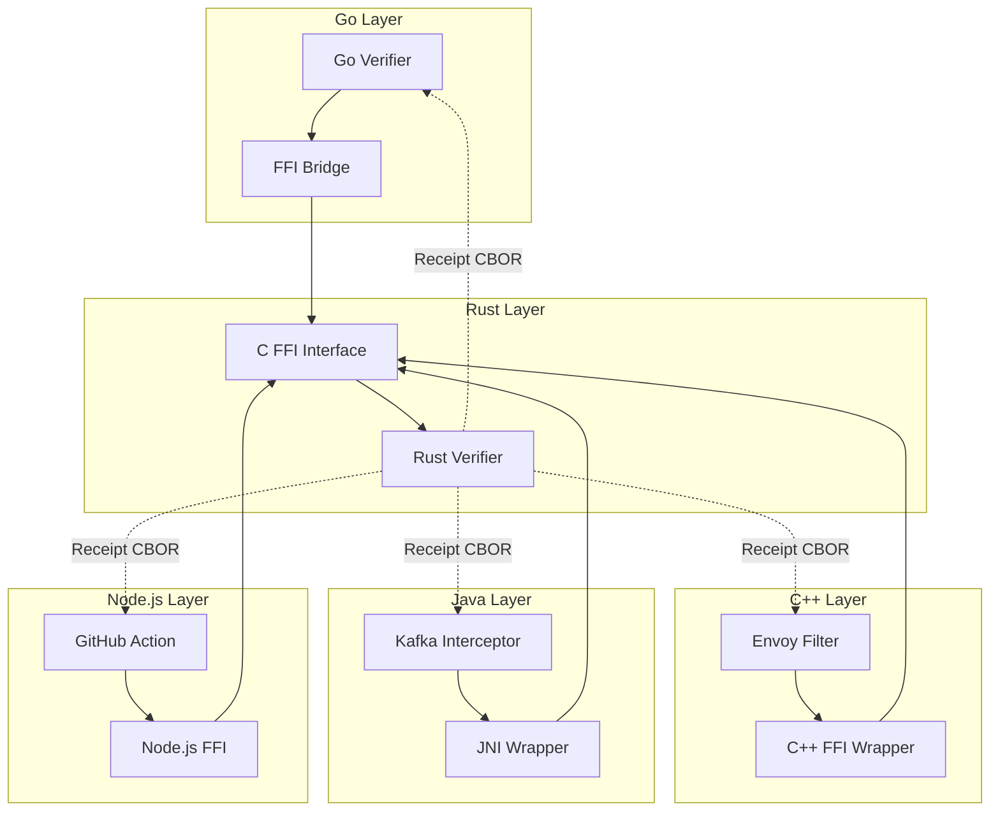
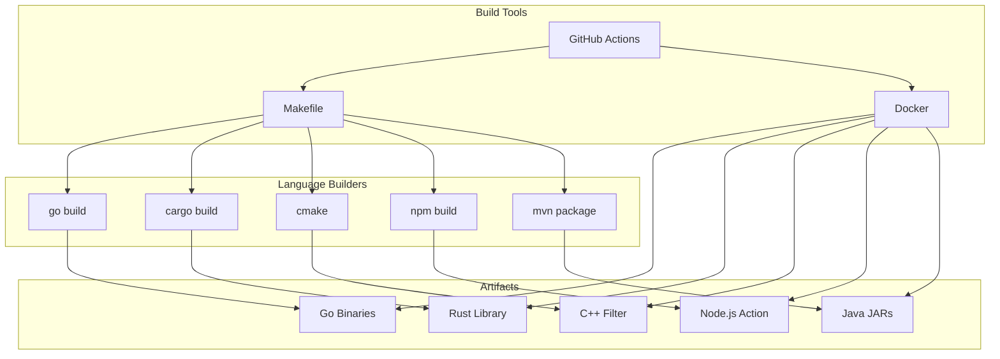
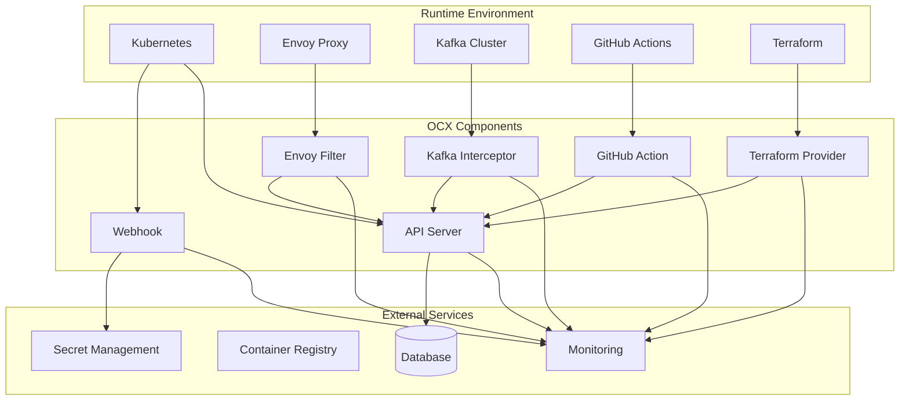

# OCX Protocol Dependency Graphs

## System Context Diagram

## Go Package Dependency Graph

## Rust Crate Dependency Graph

## Data Flow: Execute → Receipt → Verify

## Cross-Language Integration

## Build System Dependencies

## Runtime Dependencies

