# OCX Protocol Documentation

Welcome to the OCX Protocol documentation. This is the central hub for all technical documentation, specifications, and implementation guides.

## 🏗️ Architecture Overview

```mermaid
flowchart TB
%% ======== CLASSES / STYLES ========
classDef actor fill:#fdf6e3,stroke:#333,stroke-width:1px,color:#111;
classDef adapter fill:#e8f0ff,stroke:#4e79a7,stroke-width:1px,color:#0b2545;
classDef api fill:#e8f5e9,stroke:#2e7d32,color:#0a2f14;
classDef core fill:#fff3e0,stroke:#ef6c00,color:#3b2200;
classDef verify fill:#e3f2fd,stroke:#1565c0,color:#0a1e3b;
classDef store fill:#ede7f6,stroke:#5e35b1,color:#28124d;
classDef policy fill:#fffde7,stroke:#f9a825,color:#443600;
classDef analytics fill:#e0f7f7,stroke:#00796b,color:#003d39;
classDef gov fill:#fce4ec,stroke:#ad1457,color:#520a26;
classDef security fill:#f3e5f5,stroke:#6a1b9a,color:#2f0a4d;

%% ======== LAYER: ACTORS ========
subgraph L0["🎭 Actors & Stakeholders"]
direction TB
A1[Developers / Integrators]:::actor
A2[Operators / FinOps / Compliance]:::actor
A3[Auditors / Insurers / Regulators]:::actor
A4[End Users / Customers]:::actor
end

%% ======== LAYER: ADAPTERS ========
subgraph L1["🔌 Adapters (Drop-ins)"]
direction LR
AD1["GitHub Action<br/>ocx-verify-action"]:::adapter
AD2["Kubernetes Webhook<br/>label: ocx=on"]:::adapter
AD3["Airflow Operator<br/>@ocx.task"]:::adapter
AD4["FFmpeg Filter<br/>-vf ocx=emit=1"]:::adapter
AD5["PyTorch Wrapper<br/>ocx.exec(...)"]:::adapter
AD6["CLI Wrapper<br/>ocx run -- cmd"]:::adapter
end

%% ======== LAYER: API/SDK ========
subgraph L2["⚡ Ingress (CLI / SDK / API)"]
direction LR
CLI[minimal-cli]:::api
SDK["SDKs<br/>(Go/Python/Rust)"]:::api
REST["/REST API<br/>/api/v1/execute<br/>/api/v1/verify<br/>/api/v1/receipts/"]:::api
end

%% ======== LAYER: OCX CORE ========
subgraph L3["🔥 OCX Core (v1-min)"]
direction TB
C0["Spec v1-min (FROZEN)<br/>profile_id=1"]:::core
C1["Deterministic VM<br/>(no clock/syscalls/threads/FP)"]:::core
C2["Cycle Meter<br/>(alpha,beta,gamma)"]:::core
C3["Transcript Builder<br/>Hash chain → Merkle root"]:::core
C4["CBOR Serializer<br/>(canonical, strict)"]:::core
C5[Ed25519 Signer]:::core
C6["Receipt Emitter<br/>{artifact_hash,input_hash,output_hash,<br/>cycles,transcript_root,sig}"]:::core
end

%% ======== LAYER: CRI / CONFORMANCE ========
subgraph L4["✅ Truth & Conformance"]
direction LR
T1["CRI-lite (Executable Spec)<br/>slow reference interpreter"]:::verify
T2["Conformance Suite<br/>Golden receipts & vectors"]:::verify
T3["Cross-Arch Determinism Job<br/>(x86 ↔ ARM buildx/QEMU)"]:::verify
end

%% ======== LAYER: STORAGE / VERIFY ========
subgraph L5["🔍 Verify & Storage"]
direction LR
V1["Offline Verifier (lib/CLI)<br/>subtle.ConstantTimeCompare"]:::verify
V2["Hosted Verify API<br/>stateless, $5/M checks"]:::verify
S1["Receipts Store / Index<br/>immutable table + search<br/>($3/M receipts-mo)"]:::store
S2["Exporters<br/>CSV / Parquet"]:::store
end

%% ======== LAYER: POLICY / EXT (Optional) ========
subgraph L6["📋 Policy Layer (Optional, Out-of-Band)"]
direction LR
P1["OCX-EXT Envelope<br/>keeps base receipt pure"]:::policy
P2["Auditor Quorum<br/>N-of-M signatures over receipt_hash"]:::policy
P3["Billing / Chargeback<br/>cycles→$ mapping"]:::policy
P4["Compliance Mapping<br/>controls→evidence"]:::policy
end

%% ======== LAYER: ANALYTICS / BENCH ========
subgraph L7["📊 Analytics & Bench (No PII)"]
direction LR
AN1["Benchmarks<br/>exec/verify p50/p99"]:::analytics
AN2["Determinism Lab<br/>matrix across arches/vendors"]:::analytics
AN3["Atlas (Aggregate Patterns)<br/>privacy-preserving"]:::analytics
end

%% ======== LAYER: GOVERNANCE / VERSIONING / SECURITY ========
subgraph L8["🛡️ Governance / Profiles / Security"]
direction LR
G1["Profiles<br/>v1-min, v1-fp, v1-gpu<br/>(new capability = new profile)"]:::gov
G2["DISPUTES.md<br/>Drift Playbook → new golden"]:::gov
G3["FAIRNESS.md & PRICING.md<br/>(convenience + assurance only)"]:::gov
SEC1["Strict CBOR / size caps<br/>reject duplicate keys"]:::security
SEC2[Constant-time compares]:::security
SEC3[Rate/timeout bounds]:::security
end

%% ======== FLOWS ========
%% Adapters feed ingress
A1 --> AD1
A1 --> AD2
A1 --> AD3
A4 --> AD4
A1 --> AD5
A1 --> AD6

AD1 --> CLI
AD2 --> REST
AD3 --> SDK
AD4 --> CLI
AD5 --> SDK
AD6 --> CLI

%% Execute path
CLI -->|"OCX_EXEC<br/>artifact,input,max_cycles"| C1
SDK -->|OCX_EXEC| C1
REST -->|OCX_EXEC| C1

C1 --> C2 --> C3 --> C4 --> C5 --> C6
C6 -.->|"receipt (CBOR+sig)"| V1
C6 -.->|receipt| S1
C6 -.->|receipt| V2
C6 -.->|receipt| P3

%% Verify paths
V1 -->|"verify(receipt)"| A2
V2 -->|"verify API"| A2
A3 -->|"offline verify"| V1

%% Conformance / truth loop
T2 -->|"golden vectors"| C1
C6 -.->|"computed receipts"| T2
T1 -->|"arbitrate drift"| T2
T3 -->|"amd64 vs arm64 identical<br/>receipt_hash"| T2

%% Policy/EXT is optional
S1 -.->|receipt_hash| P2
P2 ..->|"quorum attestations"| A3
P4 ..->|"maps receipts→controls"| A2

%% Analytics/bench (aggregate)
S1 -.-> AN1
V2 -.-> AN1
T3 -.-> AN2
AN1 -.-> A2
AN2 -.-> A2

%% Governance / security influence
G1 --> C0
G2 --> T2
G3 --> P3
SEC1 --> C4
SEC2 --> V1
SEC3 --> REST

%% ======== NUMBERED CALLOUTS ========
C6 -.- N1["①<br/>Proof, not promises:<br/>receipts encode what ran"]
V1 -.- N2["②<br/>Offline verify:<br/>no network needed"]
T3 -.- N3["③<br/>Cross-arch determinism:<br/>identical hashes"]
G1 -.- N4["④<br/>Frozen spec + profiles:<br/>v1-min never changes"]
P1 -.- N5["⑤<br/>Policy out-of-band:<br/>base receipt stays pure"]
P3 -.- N6["⑥<br/>Fair economics:<br/>convenience + assurance only"]

%% ======== LEGEND ========
subgraph Legend["📖 Legend"]
direction TB
Lsolid["→ Solid: control/API call"]:::actor
Ldash["-.-> Dashed: data artifact (receipt/golden/hash)"]:::actor  
Ldot["..-> Dotted: optional/hosted/policy-layer"]:::actor
end
```



## 📚 Documentation Structure

### 🎯 **Core Documentation**
- **[Specification v1-min (FROZEN)](./spec-v1.md)** - Immutable core specification
- **[Architecture Diagram](./architecture-diagram.md)** - Complete system architecture
- **[API Reference](./api-reference.md)** - REST API documentation
- **[CLI Reference](./cli-reference.md)** - Command-line interface guide

### 🔧 **Implementation Guides**
- **[Getting Started](./getting-started.md)** - Quick start guide
- **[Installation](./installation.md)** - Setup and installation
- **[Configuration](./configuration.md)** - System configuration
- **[Deployment](./deployment.md)** - Production deployment

### 🧪 **Testing & Validation**
- **[Conformance Testing](./conformance-testing.md)** - Test vectors and validation
- **[Determinism Testing](./determinism-testing.md)** - Cross-platform verification
- **[Performance Testing](./performance-testing.md)** - Benchmarking and optimization
- **[Security Testing](./security-testing.md)** - Security validation

### 🔌 **Integration**
- **[Adapters](./adapters.md)** - Drop-in integrations
- **[SDKs](./sdks.md)** - Client libraries
- **[Webhooks](./webhooks.md)** - Event handling
- **[Exporters](./exporters.md)** - Data export utilities

### 🛡️ **Governance & Security**
- **[Profiles](./profiles.md)** - Version management
- **[Disputes](./disputes.md)** - Resolution procedures
- **[Fairness](./fairness.md)** - Economic principles
- **[Security](./security.md)** - Security measures

### 📊 **Analytics & Monitoring**
- **[Benchmarks](./benchmarks.md)** - Performance metrics
- **[Monitoring](./monitoring.md)** - System monitoring
- **[Analytics](./analytics.md)** - Usage analytics
- **[Reporting](./reporting.md)** - Compliance reporting

## 🚀 **Quick Start**

### **1. Installation**
```bash
# Clone the repository
git clone https://github.com/ocx-protocol/ocx.git
cd ocx

# Build the minimal CLI
go build -o minimal-cli ./cmd/minimal-cli

# Run a simple test
./minimal-cli --help
```

### **2. Basic Usage**
```bash
# Execute computation with receipt generation
./minimal-cli -command execute \
  -server "http://localhost:9000" \
  -artifact "Hello World" \
  -input "test" \
  -max-cycles 1000 \
  -lease-id "test-1"

# Verify a receipt
./minimal-cli -command verify \
  -receipt "receipt_blob_here"
```

### **3. Server Setup**
```bash
# Start the test server
go build -o test-server ./cmd/test-port
./test-server &

# Check health
curl http://localhost:9000/health
```

## 🔗 **Repository Links**

- **[/conformance](../conformance)** - Conformance testing and reference implementation
- **[/cmd/minimal-cli](../cmd/minimal-cli)** - Command-line interface
- **[/pkg/ocx](../pkg/ocx)** - Core protocol implementation
- **[/pkg/receipt](../pkg/receipt)** - Receipt generation and verification
- **[/store](../store)** - Database layer and persistence
- **[/scripts](../scripts)** - Build and deployment scripts
- **[/.github/workflows](../.github/workflows)** - CI/CD pipelines

## 📋 **Key Principles**

### ① **Proof, not promises**
OCX receipts contain mathematical proof of execution - artifact hash, input hash, output hash, cycle count, and cryptographic signature. No identity data, just verifiable facts.

### ② **Offline verify**
Anyone can validate receipts without network access using only the receipt blob and public key. No dependency on external services or registries.

### ③ **Cross-arch determinism**
The same computation produces identical receipt hashes on x86 and ARM architectures, proving true deterministic execution.

### ④ **Frozen spec + profiles**
The v1-min specification never changes. New capabilities get new profile IDs (v1-fp, v1-gpu), ensuring backward compatibility forever.

### ⑤ **Policy out-of-band**
OCX-EXT envelope carries optional metadata like auditor signatures or KYC data, keeping the base receipt identity-free and pure.

### ⑥ **Fair economics**
Revenue comes from convenience (hosted APIs) and assurance (audit services), never from lock-in or extraction. Users can always self-host and export data.

## 🎯 **Production Status**

**OCX Protocol v1.0.0-rc.1 is PRODUCTION READY** with:
- ✅ **Frozen specification** ensuring API stability
- ✅ **Cross-platform determinism** guaranteeing consistent results
- ✅ **Comprehensive testing** with 100% pass rate
- ✅ **Production-grade CI/CD** with automated validation
- ✅ **Complete documentation** with determinism proof

---

**Last Updated**: 2024-09-19  
**Version**: v1.0.0-rc.1  
**Status**: Production Ready
