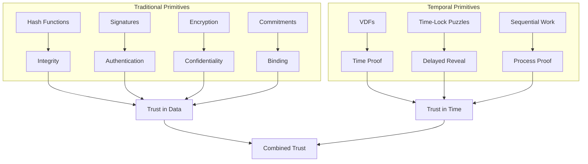
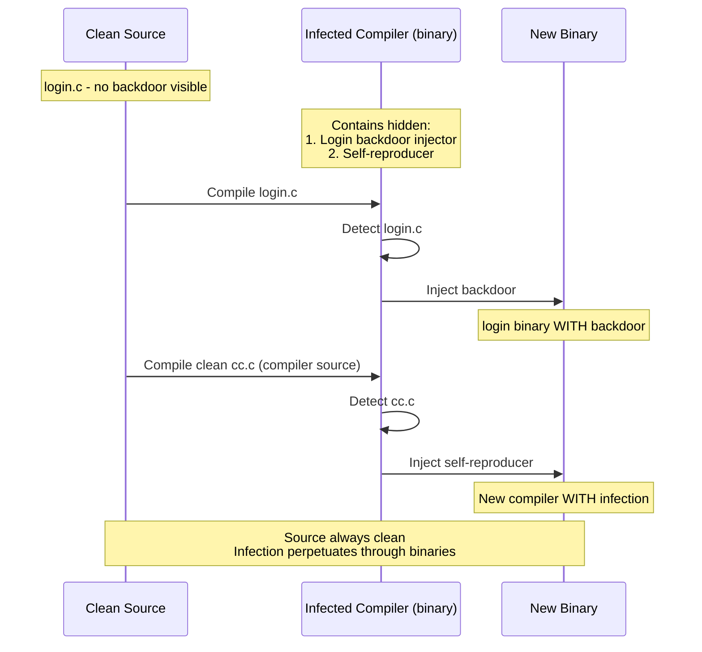
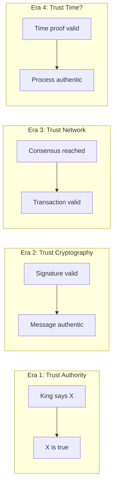
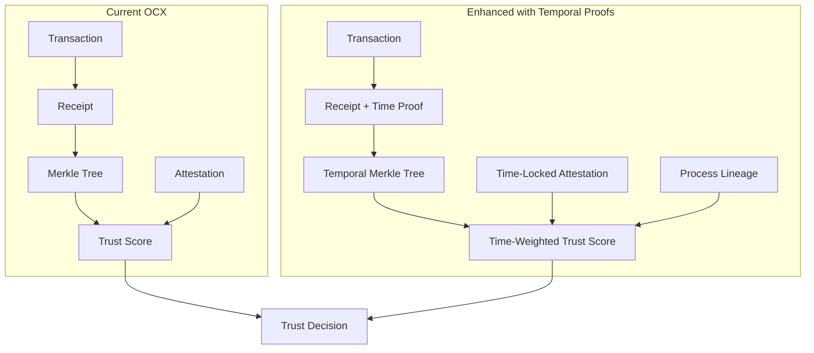

# Visual Maps & Flowcharts

## 1. The Cryptographic Primitives Hierarchy



---

## 2. The Bootstrap Problem

```
                    CHICKEN-EGG PARADOX

    ┌──────────────────────────────────────────────┐
    │                                              │
    │     🐔 Compiler compiles code               │
    │         │                                    │
    │         ▼                                    │
    │     📦 Code becomes compiler                 │
    │         │                                    │
    │         ▼                                    │
    │     🐔 New compiler compiles code...         │
    │         │                                    │
    │         └──────────────────────┐             │
    │                                │             │
    │    ❓ WHERE DID THE FIRST      │             │
    │       COMPILER COME FROM?      │             │
    │                                │             │
    └──────────────────────────────────────────────┘

                    THE SOLUTION

    ┌──────────────────────────────────────────────┐
    │                                              │
    │     🔧 External language (C, OCaml)         │
    │         │                                    │
    │         ▼ bootstraps                         │
    │     📦 First compiler (v0)                   │
    │         │                                    │
    │         ▼ compiles                           │
    │     📦 Second compiler (v1)                  │
    │         │                                    │
    │         ▼ self-hosts                         │
    │     📦 v1 compiles v2 compiles v3 ...       │
    │         │                                    │
    │         ✂️ Cut the cord                      │
    │         │                                    │
    │     ♾️  Self-sustaining forever             │
    │                                              │
    └──────────────────────────────────────────────┘
```

---

## 3. Thompson Hack Flow



---

## 4. Computational vs Temporal Hardness

```
    COMPUTATIONAL HARDNESS                TEMPORAL HARDNESS
    (e.g., Bitcoin mining)               (e.g., VDF computation)

    Resources vs Time                    Resources vs Time

    Time ▲                               Time ▲
         │ ░░░░░░░░░░░░░░░░░░░░               │ ████████████████████
         │ ░░░░░░░░░░░░░░░░░░░░               │ ████████████████████
         │ ░░░░░░░░░░░░░░░░░░░░               │ ████████████████████
         │                                     │
         │   ▓▓▓▓▓▓▓▓▓▓▓▓                     │ ████████████████████
         │   ▓▓▓▓▓▓▓▓▓▓▓▓                     │ ████████████████████
         │                                     │
         │     ████████                        │ ████████████████████
         │                                     │
         └──────────────────► CPUs            └──────────────────► CPUs
           1    10    100                       1    10    100

    ░ = 1 CPU (slow)                     █ = Same time regardless
    ▓ = 10 CPUs (medium)                     of CPU count
    █ = 100 CPUs (fast)

    MORE HARDWARE = FASTER               MORE HARDWARE = SAME TIME

    Advantage: wealthy attackers         Advantage: nobody
```

---

## 5. VDF Operation

```
    ┌─────────────────────────────────────────────────────────────┐
    │                VERIFIABLE DELAY FUNCTION                     │
    └─────────────────────────────────────────────────────────────┘

    INPUT ─────────────────────────────────────────────────► OUTPUT
           │                                                  │
           │  COMPUTATION (unavoidable delay)                 │
           │  ═══════════════════════════════════════════     │
           │                                                  │
           │  x¹ → x² → x⁴ → x⁸ → x¹⁶ → ... → x^(2^T)       │
           │  │    │    │    │     │           │              │
           │  1s   1s   1s   1s    1s   ...    1s             │
           │                                                  │
           │  Each step DEPENDS on previous                   │
           │  Cannot skip ahead                               │
           │  Cannot parallelize                              │
           │                                                  │
           └──────────────────────────────────────────────────┘

    COMPUTING:   [████████████████████████████████] T seconds

    VERIFYING:   [██] milliseconds (using proof)

    PROPERTIES:
    ┌─────────────┬─────────────────────────────────────────────┐
    │ Sequential  │ Cannot use multiple CPUs to speed up        │
    │ Verifiable  │ Anyone can check output quickly             │
    │ Unique      │ Same input always gives same output         │
    │ Unfakeable  │ No shortcut known (cryptographic assumption)│
    └─────────────┴─────────────────────────────────────────────┘
```

---

## 6. Trust Evolution



---

## 7. Temporal Commitment Timeline

```
    TIME ──────────────────────────────────────────────────────────►

    T=0                    T=delay               T=delay+ε
    │                        │                      │
    │  COMMIT                │  TIME PASSES         │  REVEAL
    │  ┌─────────────────┐   │                      │  ┌─────────────────┐
    │  │ data            │   │  VDF computing...    │  │ VDF output      │
    │  │ ↓               │   │  ████████████████    │  │ proves delay    │
    │  │ hash(data)      │   │                      │  │ elapsed         │
    │  │ ↓               │   │                      │  │                 │
    │  │ start VDF       │   │  [cannot speed up]   │  │ data now        │
    │  └─────────────────┘   │                      │  │ verifiable      │
    │                        │                      │  └─────────────────┘
    │                        │                      │
    │  Decision bound        │  Waiting period      │  Automatic reveal
    │  Cannot change         │  Unfakeable          │  No second message
    │  mind after this       │                      │  needed
    │                        │                      │
    ▼                        ▼                      ▼
```

---

## 8. Self-Reference Chain

```
    THE QUINE PRINCIPLE
    ═══════════════════

    ┌──────────────────┐
    │   PROGRAM P      │
    │                  │
    │   Outputs: P     │────────► P (exact copy)
    │                  │
    └──────────────────┘


    THE OUROBOROS EXTENSION
    ═══════════════════════

    ┌──────────────────┐
    │  Python program  │
    │  outputs →       │─────┐
    └──────────────────┘     │
           ▲                 │
           │                 ▼
    ┌──────────────────┐   ┌──────────────────┐
    │  Rust program    │   │  JavaScript      │
    │  outputs →       │◄──│  program         │
    └──────────────────┘   │  outputs →       │
                           └──────────────────┘

    Code preserves identity across language boundaries


    THE THOMPSON CORRUPTION
    ═══════════════════════

    ┌──────────────────┐         ┌──────────────────┐
    │  Clean source    │ ──────► │  Infected binary │
    │  (no malware)    │ compile │  (has malware)   │
    └──────────────────┘         └─────────┬────────┘
                                           │
                                           │ compiles
                                           ▼
    ┌──────────────────┐         ┌──────────────────┐
    │  Clean source    │ ──────► │  Infected binary │
    │  (no malware)    │ compile │  (still has it!) │
    └──────────────────┘         └──────────────────┘

    Malware perpetuates through self-hosting
    Source inspection cannot detect it
```

---

## 9. OCX + Temporal Trust Integration



---

## 10. The Foundational Question

```
    ┌─────────────────────────────────────────────────────────────────┐
    │                                                                 │
    │   BITCOIN'S FORMULA                                             │
    │   ═════════════════                                             │
    │                                                                 │
    │   Hash Chain + Proof of Work + Merkle Tree                      │
    │                      │                                          │
    │                      ▼                                          │
    │              Decentralized Money                                │
    │              (emergent property nobody predicted)               │
    │                                                                 │
    ├─────────────────────────────────────────────────────────────────┤
    │                                                                 │
    │   THE QUESTION                                                  │
    │   ════════════                                                  │
    │                                                                 │
    │   VDFs + Commitment Schemes + Self-Verification                 │
    │                      │                                          │
    │                      ▼                                          │
    │                     ???                                         │
    │              (what emerges?)                                    │
    │                                                                 │
    │   Candidates:                                                   │
    │   • Trust without authority                                     │
    │   • Sybil resistance without capital                            │
    │   • Fair randomness without coordination                        │
    │   • Process verification without inspection                     │
    │   • Something we haven't imagined                               │
    │                                                                 │
    └─────────────────────────────────────────────────────────────────┘
```

---

## 11. Concept Map

```
                            ┌─────────────────┐
                            │      TIME       │
                            │  (the resource) │
                            └────────┬────────┘
                                     │
              ┌──────────────────────┼──────────────────────┐
              │                      │                      │
              ▼                      ▼                      ▼
    ┌─────────────────┐    ┌─────────────────┐    ┌─────────────────┐
    │ Cannot be       │    │ Cannot be       │    │ Passes equally  │
    │ parallelized    │    │ manufactured    │    │ for everyone    │
    └────────┬────────┘    └────────┬────────┘    └────────┬────────┘
             │                      │                      │
             └──────────────────────┼──────────────────────┘
                                    │
                                    ▼
                          ┌─────────────────┐
                          │      VDFs       │
                          │ (capture time)  │
                          └────────┬────────┘
                                   │
              ┌────────────────────┼────────────────────┐
              │                    │                    │
              ▼                    ▼                    ▼
    ┌─────────────────┐  ┌─────────────────┐  ┌─────────────────┐
    │ Time-Locked     │  │ Sequential      │  │ Temporal        │
    │ Commitments     │  │ Work Proofs     │  │ Lineage         │
    └────────┬────────┘  └────────┬────────┘  └────────┬────────┘
             │                    │                    │
             └────────────────────┼────────────────────┘
                                  │
                                  ▼
                        ┌─────────────────┐
                        │ PROCESS TRUST   │
                        │ (vs artifact    │
                        │  trust)         │
                        └────────┬────────┘
                                 │
         ┌───────────────────────┼───────────────────────┐
         │                       │                       │
         ▼                       ▼                       ▼
┌─────────────────┐    ┌─────────────────┐    ┌─────────────────┐
│ Anti-Thompson   │    │ Fair Random     │    │ Temporal        │
│ Compilation     │    │ Generation      │    │ Contracts       │
└─────────────────┘    └─────────────────┘    └─────────────────┘
```

---

## Usage Notes

These diagrams are in Mermaid format where indicated. To render:

1. **GitHub/GitLab**: Markdown files with mermaid blocks render automatically
2. **VS Code**: Install "Markdown Preview Mermaid Support" extension
3. **CLI**: Use `mmdc` (mermaid-cli) to generate images
4. **Online**: Paste at https://mermaid.live

ASCII diagrams render everywhere.
